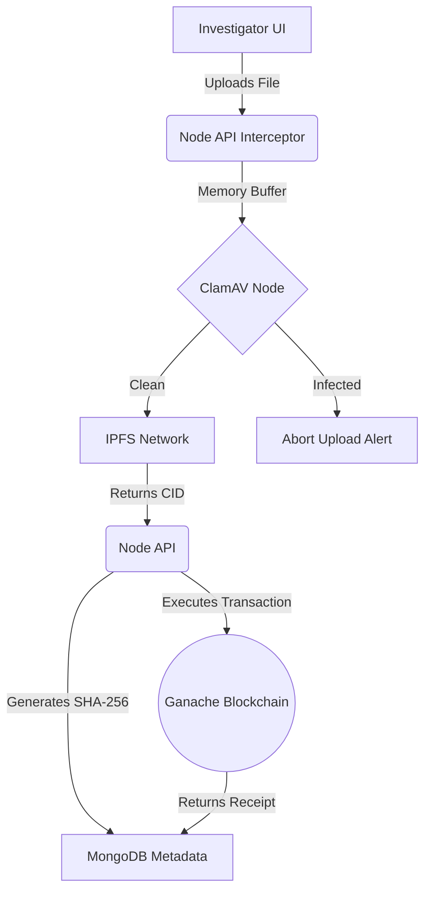

<div align="center">
  
  
  # ⚖️ Forensic Chain Enterprise
  
  <a href="https://git.io/typing-svg">
    
  </a>

  <p align="center">
    A Next-Generation Digital Forensics platform designed to eliminate evidence tampering using Ethereum Smart Contracts, P2P IPFS Storage, and Automated Hardware-Level Virus Detection.
  </p>

  <div>
    
    
    
    
    
  </div>
</div>

<br/>

## 🚀 Core Features

- **🔐 Immutable Evidence Ledger:** Uploaded raw files are mathematically hashed (SHA-256) and instantly anchored to a decentralized Ethereum Virtual Machine (Ganache/Sepolia).
- **🛡️ InterPlanetary File System (IPFS):** Heavy evidence files bypass centralized fragile databases and are distributed across P2P networks (CIDs).
- **🦠 Neural-Net ClamAV:** An isolated containerized Anti-Virus sidecar automatically intercepts memory buffers to scan for zero-day malware before IPFS upload.
- **🤝 Multi-Signature Real-World Custody:** Evidence transfers between investigating officers execute strictly upon dual-party cryptographic approval.
- **📄 Court-Ready Forensic PDFs:** The verification engine dynamically generates and stamps courtroom-certified PDF documents matching database hashes against block states.

---

## 🏗️ System Architecture Workflow



---

## ⚙️ Quick Start (Dockerized Orchestration)

This entire complex microservice architecture is abstracted away behind a single orchestrator. Ensure you have **Docker Desktop** running.

1. **Clone & Boot Environment:**
   ```bash
   git clone https://github.com/your-username/forensic-chain-system.git
   cd forensic-chain-system
   docker compose up -d --build
   ```

2. **Access the Application:**
   - **Frontend Command Center UI:** `http://localhost:3001`
   - **Backend API Node:** `http://localhost:3000`
   - **Ganache Blockchain Node:** `http://localhost:8545`

3. **Deploy Smart Contracts (First Time Only):**
   Open a secondary terminal and compile the EVM constraints into the container network:
   ```bash
   cd blockchain
   npx truffle migrate --reset --network development
   ```

---

## 🌎 Cloud Integration (Extra Mile DevOps)

Want to show this off on your mobile device during a presentation? Use LocalTunnel to instantly blast the local React build onto a secure public HTTPS URL:

```bash
npx localtunnel --port 3001
```

> **Warning**: Ensure you follow the `.env` configuration template for local execution. Wait at least 15 seconds after Docker initialization for the ClamAV daemon to completely boot.

<div align="center">
  <sub>Built with ❤️ by Dhruvil for the Final Capstone Evaluation.</sub>
</div>
